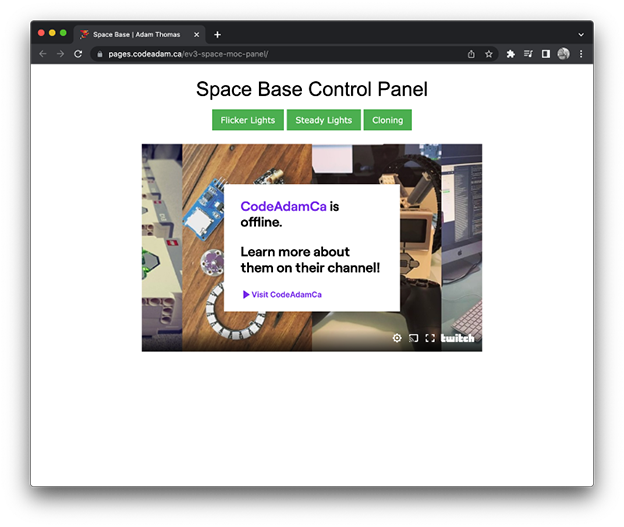

# LEGO® Mindstorms® EV3 Space Base

The source code for a LEGO base controlled using LEGO Mindstorms EV3, a PS4 controller, and a web browser interface.

> Online application is available here:  
> [https://pages.codeadam.ca/ev3-space-moc-panel](https://pages.codeadam.ca/ev3-space-moc-panel)

---

## Repo Resources

- [LEGO EV3](https://www.lego.com/en-ca/product/lego-mindstorms-ev3-31313)
- [ev3dev](https://www.ev3dev.org/)

 

